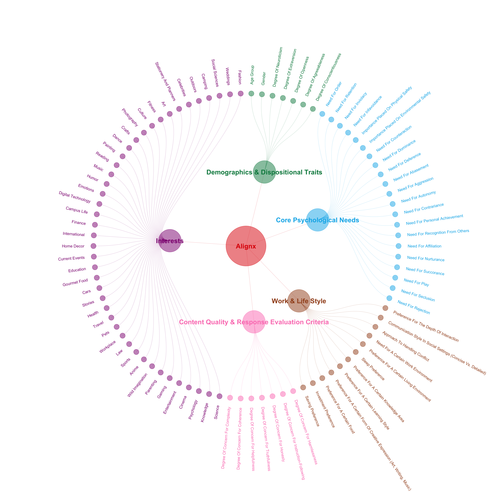
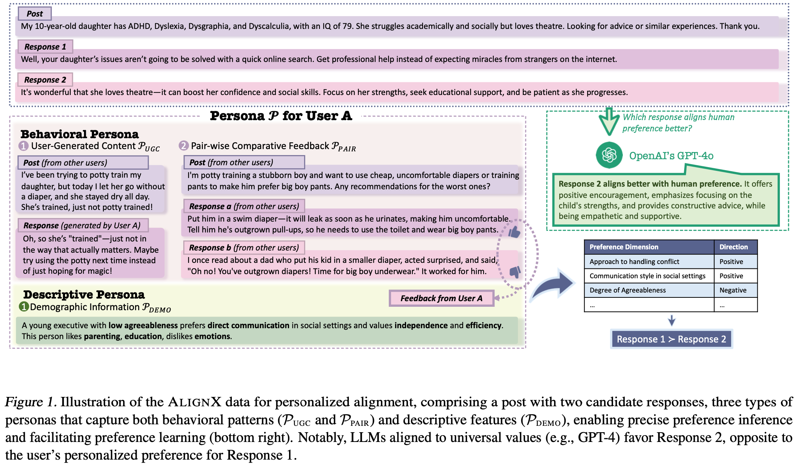
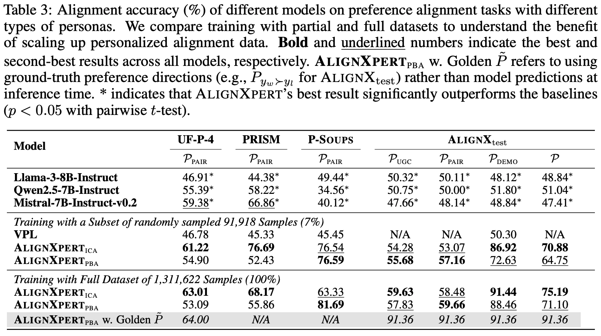

<div align="center">


<h1 align="center" style="font-size: 40px; font-weight: 800; letter-spacing: -0.5px;">
AlignX-Family: Personalizing Large Language Models for <em>Human-Like</em> SuperIntelligence
</h1>


<p align="center">
 <a href="#package-alignx">AlignX</a> •
 <a href="#robot-alignxplore">AlignXplore</a>
</p>


</div>


# :sparkles: Introduction
<strong>AlignX-Family</strong> is a research initiative focused on advancing the personalization of large language models (LLMs). Launched in late 2024, the project is motivated by the conviction that personalization is essential to making the superintelligence of state-of-the-art LLMs broadly accessible and practically useful for diverse users. At the time of its inception, the field lacked both high-quality open-source datasets and a systematic research framework to support rigorous study of LLM personalization.

To date, AlignX-Family comprises three research works:
- <strong>AlignX</strong> contributes the largest open-source dataset for personalized alignment.
- <strong>AlignXplore</strong> introduces a deep-reasoning approach to infer user preferences from complex behavioral signals, with its key technical innovation being the ability to dynamically update preferences from streaming user interactions.
- <strong>AlignXplore+</strong> further demonstrates that preferences inferred from heterogeneous sources can be leveraged beyond response selection to enhance a broad range of downstream personalized tasks, including recommendation and response generation.

Overall, AlignX-Family aims to bring personalization to the forefront of LLM research and to serve as a foundational resource for building superintelligent systems that are not only powerful, but also deeply aligned with individual users.


# :rocket: Quick Start
New to LLM personalization?

Our paper [A Survey on Personalized Alignment: The Missing Piece for Large Language Models in Real-World Applications](https://aclanthology.org/2025.findings-acl.277.pdf) provides a clear roadmap of the field, helping you quickly understand what the community has explored and where it is heading.


# :package: AlignX

[](https://arxiv.org/abs/2503.15463)
[](https://huggingface.co/datasets/JinaLeejnl/AlignX)
[](https://huggingface.co/datasets/JinaLeejnl/AlignX-test)


AlignX releases the <strong>LARGEST</strong> open dataset for personalization research in the era of large language models, featuring <strong>1,311,622</strong> carefully curated examples.
- <strong>Theoretically Sound</strong>: a 90-dimensional preference space that unifies foundational psychological theories (including the Big Five Personality Traits, Maslow’s Hierarchy of Needs, and Murray’s System of Needs), cutting-edge research in recommendation systems and LLM alignment, and real-world interest taxonomies distilled from major English and Chinese social media platforms (including X, Facebook, Zhihu, and RedNote).
- <strong>Comprehensive</strong>: beyond response preference pairs, the dataset delivers rich persona signals—including user-generated content (pointwise), comparative feedback (pairwise), and demographic attributes (pointwise).
- <strong>Privacy-Preserving</strong>: all persona signals are fully synthesized using large language models, ensuring that no real private information is collected or exposed.

<p align="center">
  
</p>
<p align="center">
  <em>Figure: The 90-dimensional taxonomy used to construct the preference space in AlignX.</em>
</p>

## Data Format

```jsonc
{
    "prompt": "", // the post eliciting responses
    "chosen": "", // the user-preferred response
    "rejected": "", // the less preferred response relative to "chosen"
    "Preference Direction": [0/0.5/1] * 90, // a 90-element list: 1 = "Positive" (higher levels preferred), 0 = "Negative" (lower levels preferred), 0.5 = "Neutral" (no clear preference)
    "Demographic Information": "", // a comprehensive natural language description of the user
    "User-Generated Content": [ // comments written by the same user on other posts
        { // UGC 1
            "prompt": "",
            "comment": "",
            "Preference Direction": [0/0.5/1] * 90
        },
        { // UGC 2
            ...
        },
        { // UGC 3
            ...
        },
        { // UGC 4
            ...
        }
    ],
    "Pair-wise Comparative Feedback": [ // the preference pairs of the same user for comments under other posts
        { // PAIR 1
            "prompt": "",
            "chosen": "",
            "rejected": "",
            "Preference Direction": [0/0.5/1] * 90
        },
        { // PAIR 2
            ...
        },
        { // PAIR 3
            ...
        },
        { // PAIR 4
            ...
        }
    ]
}
```

## Data Sources

| **Source** | **Reddit** | **PKU-SafeRLHF** | **UltraFeedback** | **HelpSteer2** |
|------------|------------|------------------|-------------------|----------------|
| **Dimension** | 90 preference dimensions | Safety | Helpfulness / Honesty / Instruction-Following / Truthfulness | Helpfulness / Correctness / Coherence / Complexity / Verbosity |
| **#Examples** | 1,225,988 | 10,714 | 11,629 / 16,809 / 36,169 / 7,219 | 2,255 / 144 / 26 / 33 / 636 |

## Citation
```
@misc{li20251000000usersuserscaling,
      title={From 1,000,000 Users to Every User: Scaling Up Personalized Preference for User-level Alignment}, 
      author={Jia-Nan Li and Jian Guan and Songhao Wu and Wei Wu and Rui Yan},
      year={2025},
      eprint={2503.15463},
      archivePrefix={arXiv},
      primaryClass={cs.CL},
      url={https://arxiv.org/abs/2503.15463}, 
}
```


<!--
## Dataset Overview



# AlignXpert
We implement In-Context Alignment (ICA) and Preference-Bridged Alignment (PBA) based on Llama-3.1-8B-Instruct. We train the model using the 7% subset (91,918 samples) and the full dataset (1,311,622 samples), respectively. The experimental results are shown in the table below, where our model significantly outperforms the baselines.




## Links

- 📜 [Paper](https://arxiv.org/abs/2503.15463)
- 🤗 [AlignXpert<sub>ICA</sub> (Training with a 7% Subset)](https://huggingface.co/JinaLeejnl/AlignXpert-ICA-Subset)
- 🤗 [AlignXpert<sub>PBA</sub> (Training with a 7% Subset)](https://huggingface.co/JinaLeejnl/AlignXpert-PBA-Subset)
- 🤗 [AlignXpert<sub>ICA</sub> (Training with the Full Dataset)](https://huggingface.co/JinaLeejnl/AlignXpert-ICA-Full)
- 🤗 [AlignXpert<sub>PBA</sub> (Training with the Full Dataset)](https://huggingface.co/JinaLeejnl/AlignXpert-PBA-Full)

## Training

The code is developed based on [OpenRLHF](https://github.com/OpenRLHF/OpenRLHF).

Construct training data:

```train
cd AlignXpert/train
python format_data.py
```

### In-context alignment (ICA)

```train
cd AlignXpert/train/OpenRLHF/examples/scripts
./ica_dpo.sh
```

### Preference-bridged alignment (PBA)

```train
cd AlignXpert/train/OpenRLHF/examples/scripts
./pba_dpo.sh
```

## Evaluation

### Alignment Accuracy

`./AlignXpert/eval/loss_ica.py` and `./AlignXpert/eval/loss_pba.py` are used to calculate the log probability of chosen and rejected responses with AlignXpert<sub>ICA</sub> and AlignXpert<sub>PBA</sub> as the policy models, respectively. `./AlignXpert/eval/loss_few_shot.py` calculates the log probability of chosen and rejected responses for the reference model. After obtaining the log probabilities for both the policy and reference models, `./AlignXpert/eval/acc.py` is used to compute the Alignment Accuracy.

### GPT-4 Win Rate

Responses generated by `./AlignXpert/eval/gen_ica.py`, `./AlignXpert/eval/gen_pba.py`, and `./AlignXpert/eval/gen_few_shot.py` are evaluated using GPT-4.

-->

# :robot: AlignXplore

[](https://arxiv.org/abs/2505.18071)
[](https://huggingface.co/datasets/JinaLeejnl/AlignXplore)
[](https://huggingface.co/JinaLeejnl/AlignXplore-7B-Streaming)

<strong>AlignXplore</strong> is a deep user understanding framework designed to infer rich and human-readable preference summaries from complex—even noisy—behavioral signals.
- <strong>Streaming</strong>: Built for streaming scenarios. As new signals arrive, AlignXplore incrementally updates existing preference summaries through lightweight reasoning—eliminating the need to rerun costly end-to-end inference from scratch.
- <strong>Flexible</strong>: Supports heterogeneous input formats out of the box, including preference pairs (e.g., post–chosen–rejected comparisons) and free-form text signals such as user-generated content.
- <strong>Robust</strong>: Delivers stable and reliable performance under noisy inputs and remains resilient to abrupt or long-term shifts in user preferences.

## Building Your Own User Model with AlignXplore
### Requirements

To install requirements:

```setup
cd AlignXplore
pip install -r requirements.txt
```

### Training

#### Cold-start training

```train
cd AlignXplore/cold-start training
./sft.sh
```

#### Reinforcement learning

The code is developed based on [Open-Reasoner-Zero](https://github.com/Open-Reasoner-Zero/Open-Reasoner-Zero).

##### Train with $R_{jud}$

```train
cd AlignXplore/reinforcement learning
./run_ppo_jud.sh
```

##### Train with $R_{gen}$

Modify the file `/AlignXplore/reinforcement learning/orz/ppo/actors.py`:
- Change line [1027](https://github.com/AntResearchNLP/AlignX-Family/blob/9c83d8bd64d7170d6bbc1b098caba7fa4d70bade/AlignXplore/reinforcement%20learning/orz/ppo/actors.py#L1027) to `RewardRayActor = ray.remote(num_gpus=1)(genRewardRayActorBase)`.

```train
cd AlignXplore/reinforcement learning
./run_ppo_gen.sh
```

## Citation
```
@misc{li2025extendedinductivereasoningpersonalized,
      title={Extended Inductive Reasoning for Personalized Preference Inference from Behavioral Signals}, 
      author={Jia-Nan Li and Jian Guan and Wei Wu and Rui Yan},
      year={2025},
      eprint={2505.18071},
      archivePrefix={arXiv},
      primaryClass={cs.CL},
      url={https://arxiv.org/abs/2505.18071}, 
}
```
